# 项目经历

## 博世中国客户管理系统

### 项目简介

为博世中国定制开发的客户管理系统，功能包括经销商、集团客户等客户管理，销售人员拜访记录；进销存、销售统计等

### 项目截图及相关说明

手机微信版使用截图

<p>
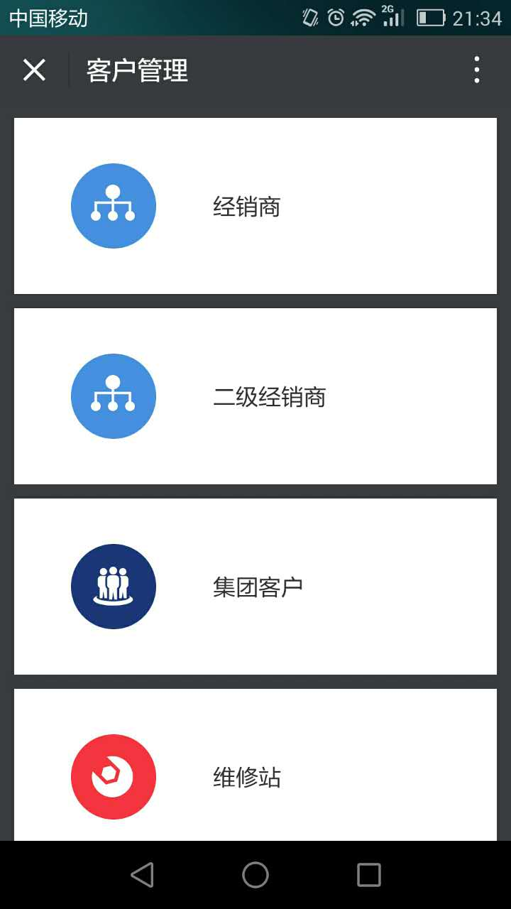
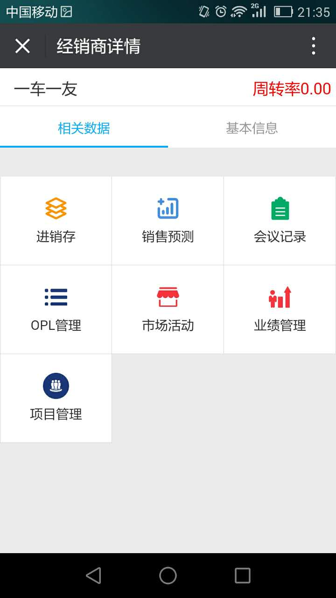
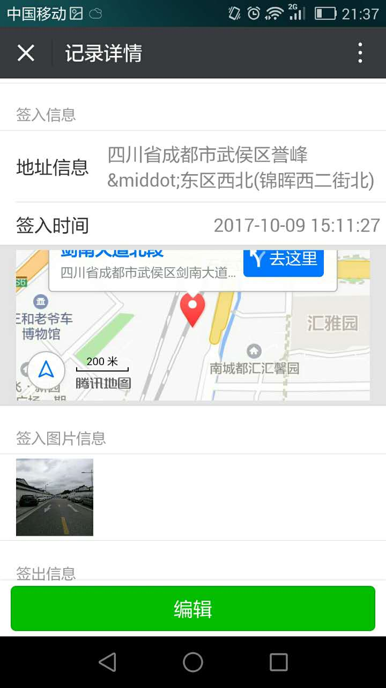
</p>

web pc版截图


系统开发使用基于NodeJS前后端分离，前端使用vue及vue组件化的思路进行开发，后台使用php开发，使用node、express、ejs搭建中间服务负责前端页面路由、静态资源访问、代理请求后端接口；我主要负责整个项目前期架构，项目过程中的人员安排、进度跟踪，项目管理及开发过程中的规范、协调及少量功能的开发；


####开发过程中遇到问题及处理方式

##### 1、页面过多，node路由管理及前端代码结构管理

说明：因为系统相对比较大、功能较多，访问的单独页面链接大概几十个，如果直接每个功能页面单独写node路由方法，每个路由需要对应相应的前端ejs功能文件；这样会使需要写的node路由较多，代码相对冗余而且无法灵活使用路由；

解决方式：

(1) 整个系统，使用一个路由，对应一个入口的ejs文件

```js

router.get('/bosch/:type/:param1?/:param2?/:param3?/:param4?', function(req, res) {
  var param={
      type:req.params.type,
      param1:req.params.param1||'',
      param2:req.params.param2||'',
      param3:req.params.param3||'',
      param4:req.params.param4||'',
      company_id: req.session.user.now_company,
      user_id: req.session.user.user_id
  };
  res.render('../dist/template/index.ejs',param)
});

```

(2) 在前端index.ejs中，有如下代码：

```
//type 为上面第一个参数type
<component is="<%=type%>"></component>

```
根据功能，定义一个入口组件，组件名称与路由参数 :type 一致，在入口组件中，会根据后面参数进行应用判断；

如，经销商列表链接：https://sfe.bosch-diagnostics.com.cn/mobile/bosch/list/5821932ae58a3adc3f8b4642

当访问这两个链接时，首先，会根据type为```list```及以上代码去寻找到list.vue的入口组件，在进入list.vue后，后根据第一个参数及本地保存的一个id(5821932ae58a3adc3f8b4642)与应用类型(is_dealer)的映射，然后寻找对应的真正展示的列表vue的组件：dealerList.vue；

```
// list.vue
<template>
	<dealer-list v-if="type == 'is_dealer'"></dealer-list>
</template>
<script>
	import dealerList from '../components/list/dealer/dealerList.vue';
	import {appIdMap} from '../../appMap';
	export default {
		created() {
			let type = document.getElementById('param1').value;
			this.type = appIdMap[type];
		},
		components: {
			dealerList
		}
	}
</script>

//appMap.js
export const appIdMap = {
	"5821932ae58a3adc3f8b4642": "is_dealer", //经销商主数据
}

//dealerList.vue 真正的展示页面代码，如果里面需要其他参数，可以在路由上继续添加，然后使用 let param2 = document.getElementById('param2').value; 灵活使用
```
按照以上方式，不仅解决了路由太多的问题（整个系统只有上面一个路由）、功能太多后代码的条理性问题（使用功能、路由、文件相关统一的方式，便可以根据链接快速找到代码文件，或者根据代码文件，快速生成访问链接），而且让以后添加新的功能更方便、快捷；


##### 2、功能较多，但重复性较高

解决方式：功能基本分为列表、新建、详情、统计几类；所以，从输入框、单选、多选、下拉框等简单的到选人、选部门、统计echart展示等复杂的，可以抽离成组件的都进行了组件化的处理，形成了对应的```.vue```文件的组件库供开发时调用，来提高开发质量和开发速度；

##### 3、因为在手机上使用，需要很高的页面及接口的请求速度

解决方式：

- 在前端静态资源，减少静态文件的请求数，对js、css等文件进行对应的合并压缩处理；
- 在请求后端接口方面，为了减少请求量，在后端php，使用gzip压缩返回，在返回后，前端再将数据进行解压；这样，可以减少至少一半的请求量，提高传输速度；
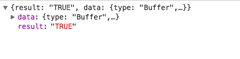

##### 4、因为客户要求进行安全反渗透测试，虽然大多在后台进行处理；前端进行了以下处理：

- 由于接口加密会导致后台处理压力增大，请求时间过长，所以最后后端接口使用压缩方式进行返回，不让数据真实的暴露在外面；
- 前端及后端均对提交字段进行标签的处理和检测，避免恶意输入js代码
- 所有文件访问不直接走原始链接访问，而是通过node后台，根据一定的协定，使用新的接口，通过fs方法，重新在服务器文件路径读取文件数据，并通过数据流的方式重新返回，并且在接口中，进行权限验证处理，如下

```js
router.get('/getFileToClient/:path', function(req, res) {
	var url = req.params.path;
	var file_name = '';
	if(url) {
    	//check.checkMobileSession 为用户权限验证
    	check.checkMobileSession(req, res, false, function () {
    		url = decodeURIComponent(url);
    		if(url) {
    			file_name = url.split('/').pop();
    			file_name = file_name.toLowerCase();
    			
                //file_url 为文件在服务器磁盘中真实路径
                var file_url = '/xxx/xxx/xxx/xx/xxx' + url;
                fs.exists(file_url,function(exist) {
                	if(exist){
                		res.set({
                			"Content-type":"application/octet-stream",
                			"Content-Disposition": "attachment; filename=" + encodeURI(file_name) + ";filename*=utf-8''" + encodeURI(file_name)
                		});
                		fReadStream = fs.createReadStream(file_url);
                		fReadStream.on("data", function(chunk){
                			res.write(chunk,"binary");
                		});
                		fReadStream.on("end",function () {
                			res.end();
                		});
                	}else{
                		res.render('./getFileError.ejs', {})
                	}
                });
            } else {
            	res.render('./getFileError.ejs', {})
            }
        });
    } else {
    	res.render('./getFileError.ejs', {})
    }
})

```


## 容大实业集团系统

### 项目简介

为容大实业集团开发的工作计划管理系统，包括经营计划、经营分析、各事业部申请流程等相关功能；

### 项目截图及相关说明

手机微信版使用截图

<p>
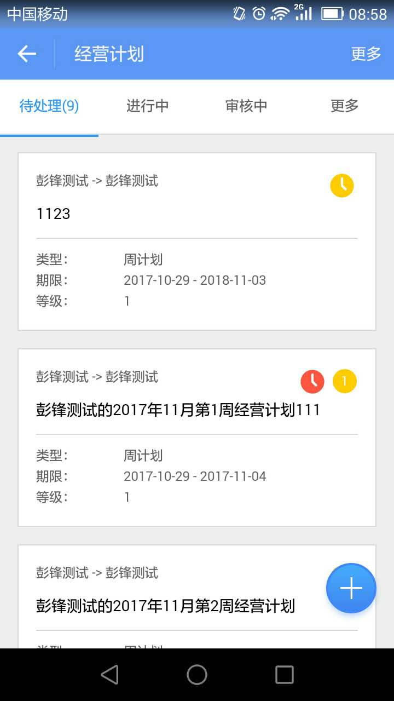
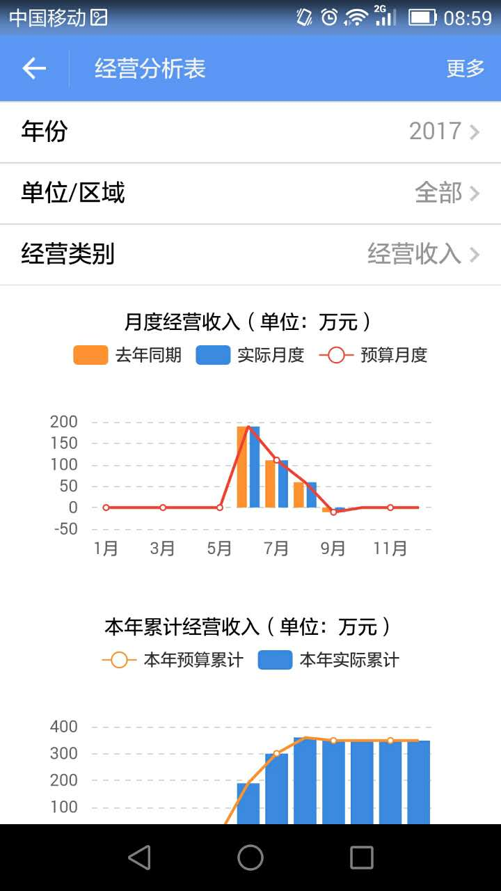
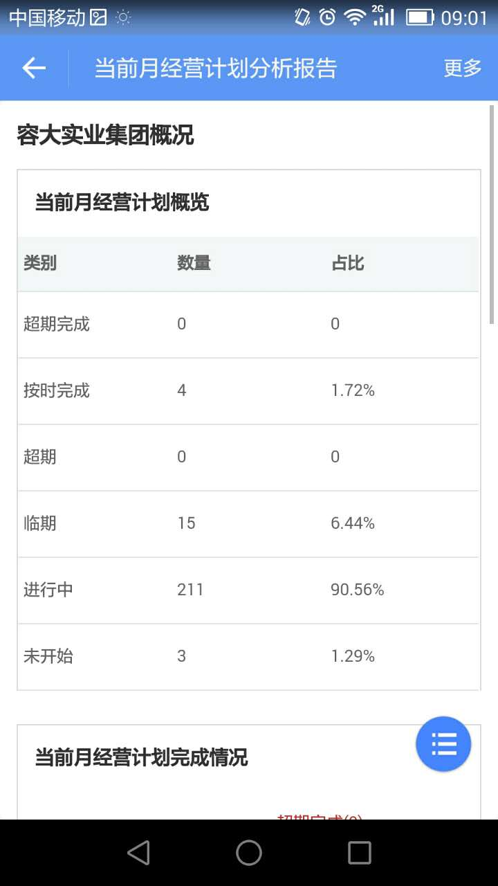
</p>

web pc版截图

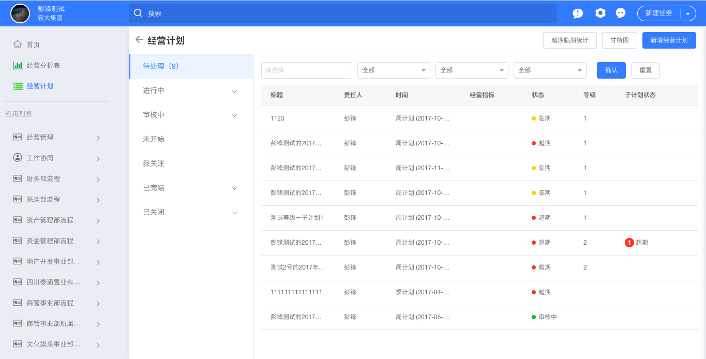
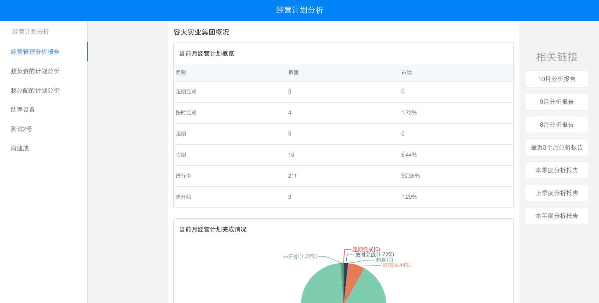

系统整体架构和实现方式沿用了上面博世系统的开发模式进行，使用前后端分离，node路由，路由通过一个统一路由，根据参数不同，前端使用不同的vue组件；不同的有以下部分：

1、在后期开发，为了提高开发效率，节约开发成本，使用web与钉钉访问同一个链接，同一个页面，在页面中使用css3媒体查询的方式进行适配处理，如上手机截图3 与 web截图2；

2、在此项目中，因为手机是在钉钉上使用，为了提高使用体验，在开发中，基本调用钉钉js sdk提供的方法进行处理，所以在写组件时，需要去考虑兼容钉钉、web与普通手机页面访问；然后我这边根据node后台请求的header信息,判断访问的应用入口

```js

function getPlatform(req) {
  if (req.headers && ((req.headers['x-requested-with'] && req.headers['x-requested-with'] == 'com.alibaba.android.rimet') ||
    (req.headers['user-agent'] && (req.headers['user-agent'].indexOf('com.alibaba.android.rimet') != -1 || req.headers['user-agent'].indexOf('DingTalk') != -1)))) {
    return 'dingding';
  }
  return 'normal'
}

```

3、为了更好的提高体验，登录过程使用自动登录的方式，根据钉钉登录帐号，调用钉钉sdk，与我们自己系统进行匹配，实现自动登录

```
dd.ready(function() {
	dd.runtime.permission.requestAuthCode({
            corpId: map[nowCompanyId],
            onSuccess: function(result) {
            	var params = {
            		functionName: "getDingUserByCode",
            		code: result.code,
            		company_id: nowCompanyId,
                	httpType: "post",
                	serviceName: "dingding",
            	}
            	ajaxQueryWX(false, params, function(res) {
	            	$.ajax({
	            		type: 'POST',
	            		url: '/hybid/dingdingLogin',
	            		data: {
	            			user_id: res.data._id,
	            			token: res.data.token,
	            			company_id: nowCompanyId,
	                    jwt: res.jwt,
	                    referer: referer
	                },
	                dataType: 'json',
	                success: function(res) {
	                	window.location.href = res.data;
	                },
	                error: function(err) {
	                	console.log(err)
	                }
	            });
            }, function(res) {
            	
            });
        },
        onFail: function(err) {
        	console.log(err)
        }
    })
})
dd.error(function(err) {
	console.log(err)
})

```

## dingtalkweui组件库

### 项目简介

基于以上项目及日常开发，越来越觉得应该有一套完整的兼容微信、钉钉、普通页面访问的vue组件库供开发使用，这样不仅可以在每个新的项目，不需要重新去写新的组件或者拷贝以前的组件，也可以更好、更统一的管理和使用组件库；所以，自己就开始这个项目，此项目非公司要求，而是自己个人日常开发，属于个人行为；

[项目git地址: https://github.com/pf12345/dingtalkweui](https://github.com/pf12345/dingtalkweui)

[项目npm地址: https://www.npmjs.com/package/dingtalkweui](https://www.npmjs.com/package/dingtalkweui)

### 项目截图及相关说明

<p>
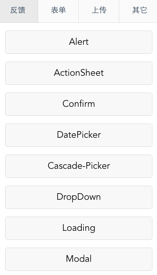
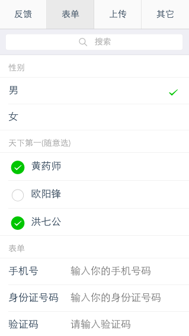
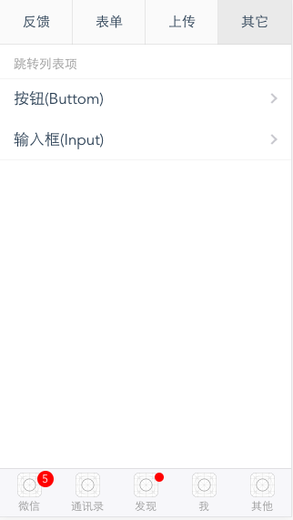
</p>

在项目组件选择中，界面展示参照weui；在进入系统时，会根据以下方法自动判断平台信息, 后续会根据反馈逐渐完善：

```js
export const getPlatform = function() {
	if(window.navigator && window.navigator.userAgent) {
		if(window.navigator.userAgent.indexOf('DingTalk') != -1) {
			return 'dingtalk';
		} else if(window.navigator.userAgent.indexOf('MicroMessenger') != -1){
			return 'weixin';
		} else {
			return 'nomal';
		}
	}
	return '';
}

```

在每个组件使用上，尤其反馈操作中，会根据平台信息，使用不同的实现方式；如弹窗提示，当检测钉钉平台时，会默认调用钉钉sdk提供的弹窗方法。当检测到微信或其他的，会默认调用weui提供的弹窗方法实现；并且将weui已有的单选、多选、底部栏、按钮、输入框等都进行了重新vue的组件化的封装，后面会在此基础上，去逐渐增加和完善组件，提供一套可以简单、完整调用的手机开发组件库；

## 自定义流程(业务描述引擎)

### 项目简介

公司根据需要，开发的一套可以灵活配置流程、且自动进行流转的功能系统；每个公司，可以根据自己需要，配置不一样的流程字段；也可以根据自己的业务不同，业务走向的不同，自定义流程的行走方式，因此也称为“业务描述引擎”

### 项目截图及相关说明

web pc版截图

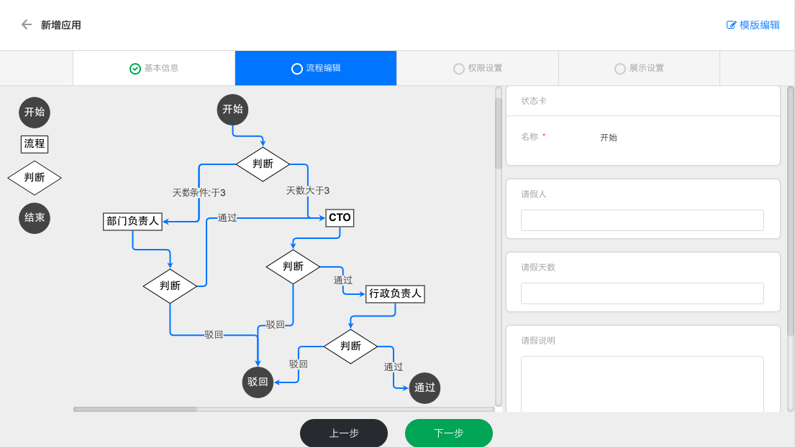
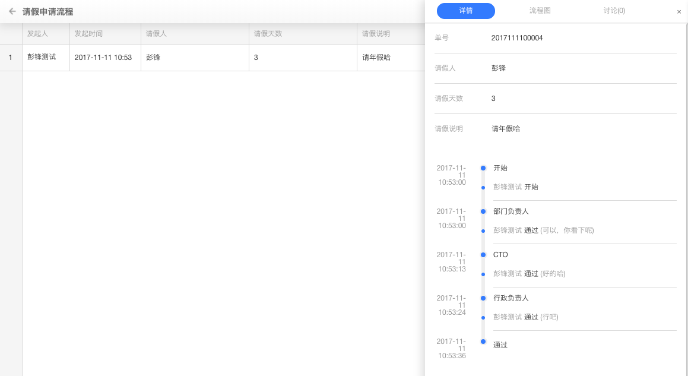
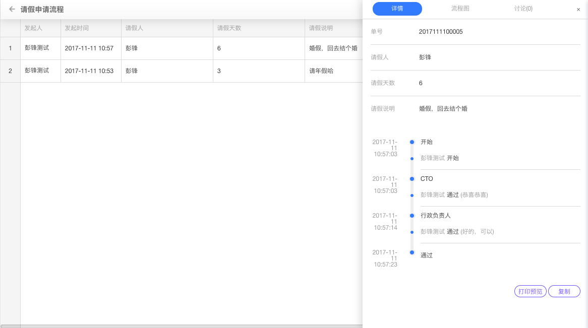

如上图所示，会根据请假不同天数，去走不一样的审批人，走不一样的流程；

在开发时，vue还没有出来，所以当时选择使用了angular 1去实现功能；而在流程配置过程，选用了go.js实现流程图的配置、编辑和展示；而页面路由，使用angular路由进行实现，主要分为列表、详情、新建、配置几个页面；

为了以后更好维护，我们将所有页面也进行了组件化隔离，使用angular```directive```实现, 每个组件有自己单独的html页面代码：

```
angular.module('appUpgrade.directives', []).directive('nav', ['$timeout', '$rootScope', function ($timeout, $rootScope) {
        return {
            restrict: 'E',
            replace: true,
            templateUrl: '/web/appUpgrade/directives/nav.html',
            link: function (scope) {

            }
        }
    }]).directive('footer', ['$timeout', '$rootScope', function ($timeout, $rootScope) {
        return {
            restrict: 'E',
            replace: true,
            templateUrl: '/web/appUpgrade/directives/footer.html',
            link: function (scope) {

            }
        }
    }])

```