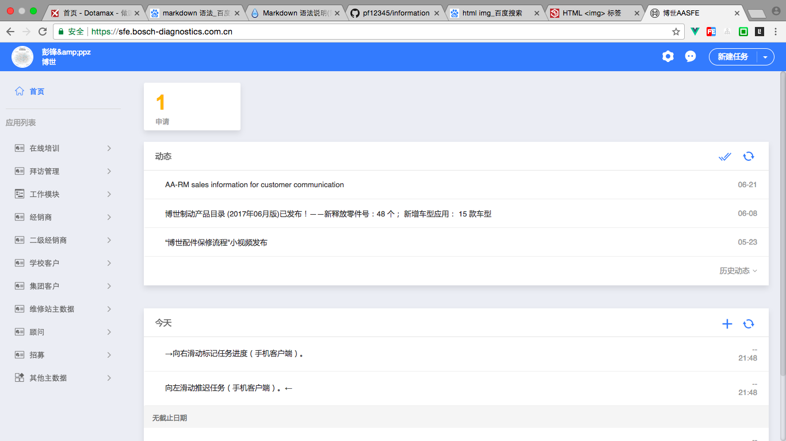

# 项目经历

## 博世中国客户管理系统

### 项目简介

为博世中国定制开发的客户管理系统，功能包括经销商、集团客户等客户管理，销售人员拜访记录；进销存、销售统计等

### 项目截图及相关说明

手机微信版使用截图

<p>


</p>

web pc版截图



系统开发使用基于NodeJS前后端分离，前端使用vue及vue组件化的思路进行开发，后台使用php开发，使用node、express、ejs搭建中间服务负责前端页面路由、静态资源访问、代理请求后端接口；我主要负责整个项目前期架构，项目过程中的人员安排、进度跟踪，项目管理及开发过程中的规范、协调及少量功能的开发；


####开发过程中遇到问题及处理方式

##### 1、页面过多，node路由管理及前端代码结构管理

说明：因为系统相对比较大、功能较多，访问的单独页面链接大概几十个，如果直接每个功能页面单独写node路由方法，每个路由需要对应相应的前端ejs功能文件；这样会使需要写的node路由较多，代码相对冗余而且无法灵活使用路由；

解决方式：

(1) 整个系统，使用一个路由，对应一个入口的ejs文件

```js

router.get('/bosch/:type/:param1?/:param2?/:param3?/:param4?', function(req, res) {
  var param={
      type:req.params.type,
      param1:req.params.param1||'',
      param2:req.params.param2||'',
      param3:req.params.param3||'',
      param4:req.params.param4||'',
      company_id: req.session.user.now_company,
      user_id: req.session.user.user_id
  };
  res.render('../dist/template/index.ejs',param)
});

```

(2) 在前端index.ejs中，有如下代码：

```
//type 为上面第一个参数type
<component is="<%=type%>"></component>

```
根据功能，定义一个入口组件，组件名称与路由参数 :type 一致，在入口组件中，会根据后面参数进行应用判断；

如，经销商列表链接：https://sfe.bosch-diagnostics.com.cn/mobile/bosch/list/5821932ae58a3adc3f8b4642

当访问这两个链接时，首先，会根据type为```list```及以上代码去寻找到list.vue的入口组件，在进入list.vue后，后根据第一个参数及本地保存的一个id(5821932ae58a3adc3f8b4642)与应用类型(is_dealer)的映射，然后寻找对应的真正展示的列表vue的组件：dealerList.vue；

```
// list.vue
<template>
	<dealer-list v-if="type == 'is_dealer'"></dealer-list>
</template>
<script>
	import dealerList from '../components/list/dealer/dealerList.vue';
	import {appIdMap} from '../../appMap';
	export default {
		created() {
			let type = document.getElementById('param1').value;
			this.type = appIdMap[type];
		},
		components: {
			dealerList
		}
	}
</script>

//appMap.js
export const appIdMap = {
	"5821932ae58a3adc3f8b4642": "is_dealer", //经销商主数据
}

//dealerList.vue 真正的展示页面代码，如果里面需要其他参数，可以在路由上继续添加，然后使用 let param2 = document.getElementById('param2').value; 灵活使用
```
按照以上方式，不仅解决了路由太多的问题（整个系统只有上面一个路由）、功能太多后代码的条理性问题（使用功能、路由、文件相关统一的方式，便可以根据链接快速找到代码文件，或者根据代码文件，快速生成访问链接），而且让以后添加新的功能更方便、快捷；


##### 2、功能较多，但重复性较高

解决方式：功能基本分为列表、新建、详情、统计几类；所以，从输入框、单选、多选、下拉框等简单的到选人、选部门、统计echart展示等复杂的，可以抽离成组件的都进行了组件化的处理，形成了对应的```.vue```文件的组件库供开发时调用，来提高开发质量和开发速度；

##### 3、因为在手机上使用，需要很高的页面及接口的请求速度

解决方式：

- 在前端静态资源，减少静态文件的请求数，对js、css等文件进行对应的合并压缩处理；
- 在请求后端接口方面，为了减少请求量，在后端php，使用gzip压缩返回，在返回后，前端再将数据进行解压；这样，可以减少至少一半的请求量，提高传输速度；


## 容大实业集团系统


